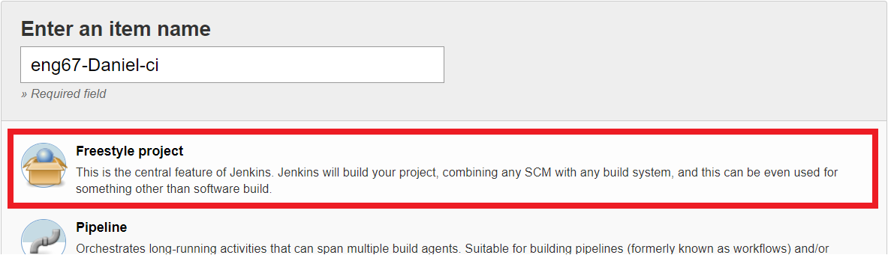

# Creating a CI/CD Pipeline

#### First I create a webhook for the repository I will be using. Go into the repository and click on settings > Webhooks > add webhook


#### Then I added the payload URL. In this case it is the Jenkins IP that we are using followed by github-webhook.I also changed the content type to JSON. It can be seen below:
``` http://18.132.46.105:8080/github-webhook/ ```


# CI - Continuous Integration

#### 1 ) First, on the Jenkins dashboard, click on new item as seen below.


#### 2) Then type in the item name and select the type of project. I will be using a Freestyle project.



#### 3) You must then enter in the configurations that you would like to use for this CI job. They will vary from job to job.
#### [Click here to see the configuration of my CI Job](https://github.com/DanTeegan/AWS_webapp/blob/master/CI-CD Configuration/CI_config.pdf)

#### 4) Next I tested the job by clicking build now. The jobs can be seen in the build history. Note, This configuration was set up so that when I push to github the build will automatically start.


#### 5) The build succesfully passed! You can check this in the console. If any errors occur go back and check the configuration file


# CD – Continuous deployment

#### We start the same as creating a CI job. First on the dashboard click on new item and then enter the name. As this is the deployment job it is best practice to use deploy in the name. Again, this will be a freestyle project.

#### [For the full configuration of the CD job please click here](https://github.com/DanTeegan/AWS_webapp/blob/master/CI-CD Configuration/CD_config.pdf)

#### One import bit of code within the CD config is the execute shell commands. The SCP command syncs the files we choose into the VM.

```
scp -o "StrictHostKeyChecking=no" -r app/ ubuntu@54.246.11.0:/home/ubuntu/
scp -o "StrictHostKeyChecking=no" -r environment/ ubuntu@54.246.11.0:/home/ubuntu/
ssh -o "StrictHostKeyChecking=no" ubuntu@54.246.11.0 <<EOF
    sudo bash ./environment/app/provisions.sh
    cd app
    pm2 kill
    pm2 start app.js
EOF
```

#### Once the configuration is set up, we can then test the job. Note the configuration of this job has been set so that once the CI job passes it automatically builds the CD job. However, for testing purposes we can click on build.


#### Once again to check the status of the build we can view the console output. We successfully passed the tests.


# Security groups

#### Now both jobs have been tested and are working we must allow access to jenkins on AWS using security groups.

#### As seen below I created a new inbound rule with a type of ssh, port 22 and used the IP address of the Jenkins server I was using.


#### Now when I revisit the IP address off my APP EC2 instance changes have automatically been pushed. This process used a CI/CD pipeline to automate the integration and deployment of files.


