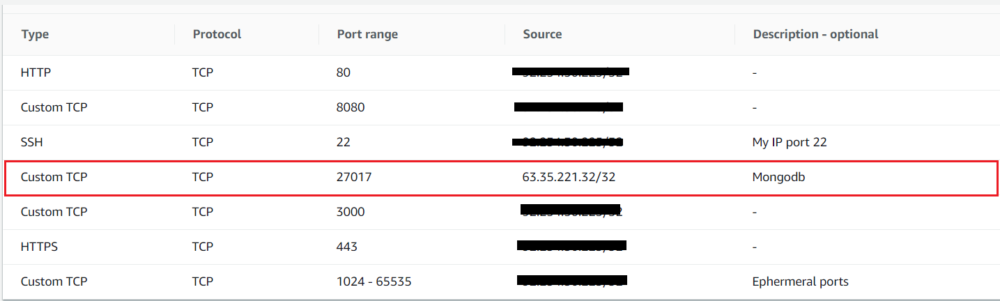

# Creating and linking 2 EC2 Instances

The next task was the following “As as user I want to go to an public IP (from your aws machine) and go to your app on /posts/ and see the posts in the app.. All on port 80”

To do this I needed to create a new EC2 instance called DB.  A full guide on creating a EC2 instance can be found by clicking here


Once I had 2 EC2 instances running (One app One DB) I had to create a security group to link both instances. Inside the App instance I edited the inbound rules and allowed the connection from the DB instance. The port range was set as 27017 as seen below. The source was the IP address from the DB instance.



# Installing and configuring mongodB

I then ssh into both the app and the DB VM. In the DB VM I ran the provision script using the command
 
```./provisions.sh```

Inside the APP VM I created an environment variable using DB_HOST=mongodb://52.209.11.237:27017/posts (This is the IP address of the db instance)

Then inside the DB VM I went to the root using cd and then entered into the etc directory by using

``` cd etc ```

2 mongod.conf files where present and highlighted in red. I removed them both using

``` sudo rm mongod.conf```

I then recreated the mongod.conf file and pasted in the required code

``` sudo nano mongod.conf ```

I then restarted mongodb and checked its status, commands below. This is everything I that needs to be done on the DB VM.

``` systemctl restart mongod ```

``` systemctl status mongod ```

# Working in the app VM

Now in the APP VM I ran NPM install which would install some of the dependencies needed.

``` npm install ```

Then I ran the app provisions 

``` provisions.sh ```

Finally I ran ```pm2 start app.js```


